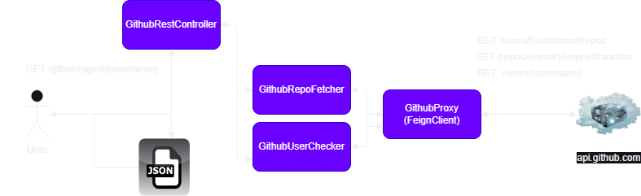

<h1 align="center">Github API Consumer
</h1>

<h2>Overview</h2>

GitHub Consumer API is a project aimed at integrating with the GitHub API as a backing API. By leveraging the GitHub API documented at <a href="https://developer.github.com/v3">GitHub Developer</a>, this project allows users to retrieve key information regarding repositories and their branches.

<h2>Features</h2>
<ul>
  <li>Utilizes <strong>OpenFeign</strong> for seamless integration with the GitHub API.</li>
  <li><strong>Provides endpoint to fetch repository information including:</strong>
    <ul>
      <li>Repository Name</li>
      <li>Owner Login</li>
      <li>Branches: Name and Last Commit SHA</li>
    </ul>
  </li>
  <li>Handles exceptions for providind non-existing GitHub users by returning a 404 status with a message.</li>
  <li>Supports handling exceptions for unsupported media type AcceptHeader: application/xml, returning 406 with message</li>
</ul>

## Diagram

 
 

|       ENDPOINT         | METHOD  |         REQUEST          |       RESPONSE       |                    FUNCTION                                |
|:----------------------:|:-------:|:------------------------:|:--------------------:|:----------------------------------------------------------:|
|/github/agent/{username}|  GET    | PATH VARIABLE (username) |  JSON (repositories) | returns all users repos with branches and last commits sha |

## Tech Stack
Code:  

 
Tests:  

 
Other:  

<h2>Future Improvements</h2>

Some improvements for enhancing the project in the future:

<ul>
  <li>Implement integration tests using WireMock to test Feign clients.</li>
  <li>Add more unit tests to improve code coverage and reliability.</li>
</ul>

<h2>Contributing</h2>

Contributions are welcome! Feel free to submit bug reports, feature requests, or pull requests to help improve this project.

